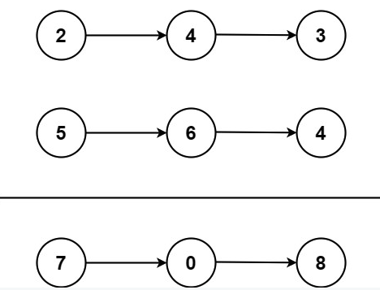

You are given two non-empty linked lists representing two non-negative integers. 

The digits are stored in reverse order, and each of their nodes contains a single digit. Add the two numbers and return the sum as a linked list.

You may assume the two numbers do not contain any leading zero, except the number 0 itself.

### Examples:
```
Input: l1 = [2,4,3], l2 = [5,6,4]
Output: [7,0,8]
Explanation: 342 + 465 = 807.


Input: l1 = [0], l2 = [0]
Output: [0]


Input: l1 = [9,9,9,9,9,9,9], l2 = [9,9,9,9]
Output: [8,9,9,9,0,0,0,1]
```


### Constraints:
- The number of nodes in each linked list is in the range [1, 100].
- 0 <= Node.val <= 9
- It is guaranteed that the list represents a number that does not have leading zeros.

```java
/**
 * Definition for singly-linked list.
 * public class ListNode {
 *     int val;
 *     ListNode next;
 *     ListNode() {}
 *     ListNode(int val) { this.val = val; }
 *     ListNode(int val, ListNode next) { this.val = val; this.next = next; }
 * }
 */
class Solution {

    public ListNode addTwoNumbers(ListNode l1, ListNode l2) {
        ListNode result = null;
        ListNode head = result;
        boolean upper = false;
        while (l1 != null || l2 != null) {
            int d = ((l1 == null) ? 0 : l1.val) + ((l2 == null) ? 0 : l2.val);
            if (upper) {
                d++;
                upper = false;
            }

            ListNode tmp = new ListNode();
            if (d >= 10) {
                upper = true;
                d = d % 10;
            }
            tmp.val = d;

            if (result == null) {
                result = tmp;
                head = result;
            } else {
                result.next = tmp;
                result = result.next;
            }

            if (l1 != null) {
                l1 = l1.next;
            }
            if (l2 != null) {
                l2 = l2.next;
            }
        }

        if (upper) {
            result.next = new ListNode(1);
        }
        return head;
    }
}

```